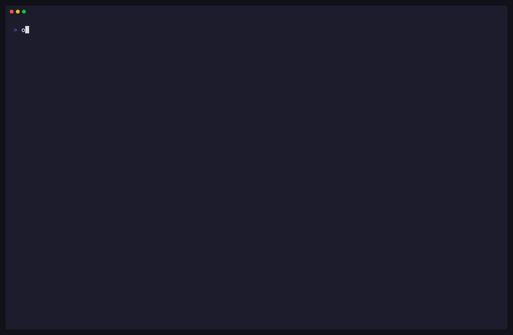

# okdctl

[](https://github.com/qxtaiba/okdctl/actions/workflows/ci.yml)
[](https://github.com/qxtaiba/okdctl/releases)
[](LICENSE)

okdctl provisions OKD clusters on Proxmox VE from an interactive wizard.
It's for the homelab operator with one or two Proxmox nodes who wants a real
Kubernetes cluster without hand-rolling Terraform, Ignition, and bootstrap glue.



## What it isn't

- Not a managed service, not a wrapper around the Red Hat Assisted Installer.
- Not k3s or microk8s — this is upstream OKD with the full operator surface.
- Not multi-cluster or multi-tenant; one cluster per `okdctl.yaml`.
- Not a production OKD distribution. Pre-1.0 — the config schema breaks
  between minors (every break is in the [CHANGELOG](CHANGELOG.md)); pin
  your version.

okdctl collects no telemetry and no analytics. The one request it makes on
its own behalf is an update check: release builds send a plain HTTPS GET to
`api.github.com` (`releases/latest`) — nothing beyond what any HTTP request
carries — at most once per 24 hours, cached in
`~/.cache/okdctl/update-check.json`. Set `OKDCTL_NO_UPDATE_CHECK=1` to turn
it off.

## Install

Linux only — the deploy phase shells out to `dnf`/`apt`, `firewall-cmd`,
`nmcli`, and `systemctl`. Install on the bastion host you intend to deploy
from.

**curl | bash** (verifies SHA256):

```bash
curl -sSfL https://raw.githubusercontent.com/qxtaiba/okdctl/develop/scripts/install.sh | bash
```

**`.deb` / `.rpm`** from the [releases page](https://github.com/qxtaiba/okdctl/releases)
for apt/dnf users.

**From source:**

```sh
git clone https://github.com/qxtaiba/okdctl
cd okdctl
make build
sudo install -m 0755 bin/okdctl /usr/local/bin/
```

Releases are sigstore-signed (keyless) and ship with a CycloneDX SBOM and
SLSA build provenance. Verify with `cosign verify-blob` — see
[Verifying a release](#verifying-a-release) below.

### Shell completion

```sh
# bash — persistent
okdctl completion bash > /etc/bash_completion.d/okdctl

# bash — current session only
source <(okdctl completion bash)

# zsh — persistent (pick a dir in $fpath)
okdctl completion zsh > "${fpath[1]}/_okdctl"

# zsh — current session only
source <(okdctl completion zsh)

# fish
okdctl completion fish > ~/.config/fish/completions/okdctl.fish
```

## Quick start

```sh
mkdir my-cluster && cd my-cluster
okdctl deploy
```

The wizard asks for Proxmox credentials and cluster shape, writes
`okdctl.yaml` and `okdctl.env`, then deploys.

## Usage

```
okdctl addon            manage cluster addons
okdctl cleanup          remove OKD cluster artifacts without destroying infrastructure
okdctl completion       generate shell completion script
okdctl config           inspect okdctl configuration
okdctl debug-bundle     collect a support bundle for troubleshooting
okdctl deploy           deploy a Kubernetes cluster
okdctl describe         drill into a specific node or addon
okdctl destroy          destroy a Kubernetes cluster
okdctl doctor           check that your environment is ready to deploy a cluster
okdctl kubeconfig       print or export the cluster kubeconfig
okdctl releases         query available OKD versions
okdctl status           print a post-deploy cluster summary
okdctl update-ingress   switch ingress DNS from HAProxy to LoadBalancer IPs
okdctl version          print version, git commit, build date
```

Full command reference: [`docs/cli/okdctl.md`](docs/cli/okdctl.md).
Exit codes and shell-script idioms: [`docs/cli/exit-codes.md`](docs/cli/exit-codes.md).

Run `deploy` from any directory — an empty one works. One working directory
is one cluster: okdctl writes everything next to where you run it. First
run materializes the Terraform sources embedded in the binary into
`infrastructure/terraform/` (write-once — existing files, e.g. from a
source checkout or hand-edited HCL, are never overwritten), launches the
wizard, and writes `okdctl.yaml` plus an `okdctl.env` file next to the
config (named after the config file) for Proxmox credentials. The deploy
itself adds an `okd-install/` work directory and Terraform state under
`infrastructure/terraform/environments/`. `deploy`, `destroy`, and
`cleanup` append their full log to `okdctl.log` next to the config
(credentials redacted, one `run_id` per invocation), so a failed deploy
stays diagnosable after the scrollback is gone — `okdctl debug-bundle`
picks it up automatically, `--log-file` redirects it. Later runs reuse the
existing config; commands that operate on an existing cluster (`status`,
`destroy`, `kubeconfig`, `debug-bundle`) must run from the same directory.
For multiple clusters, use one directory per cluster (`--config other.yaml`
selects an alternate config within one).

A deploy runs three phases: **setup** installs the tool trio (`oc`,
`openshift-install`, `terraform`) and host packages, renders manifests and
custom CoreOS ISOs, and configures HAProxy/DNS/firewall on the bastion;
**install** brings the VMs up via Terraform and waits for bootstrap and
CSR approval; **post-install** removes the bootstrap node, migrates
ingress to LoadBalancer IPs if available, and installs any addons you
picked. Each phase is a sequence of steps with rollback on failure;
re-running `deploy` after an interruption picks up where it left off. If
the work directory holds a completed cluster, run `okdctl destroy` first;
`--fresh` force-wipes it without destroying (credentials will be lost).

Phase internals, addon system, and wizard architecture live in
[`docs/architecture/`](docs/architecture/). Per-addon reference:
[Flux](docs/addons/flux.md),
[1Password Secret Store](docs/addons/secretstore.md).

## Configuration

Use the wizard. If you'd rather edit YAML directly, reference configs live
in [`configs/examples/`](configs/examples/): `minimal.yaml` (1
control-plane node, 0 workers — single-node cluster), `production.yaml`
(3 control-plane, 5 worker layout), `media-server.yaml` (homelab setup
with storage-heavy workers).

Proxmox credentials live in the `okdctl.env` file next to the config,
never in the YAML. Env vars: `PROXMOX_VE_ENDPOINT`, `PROXMOX_VE_USERNAME`,
`PROXMOX_VE_PASSWORD` (or `PROXMOX_VE_API_TOKEN`).

### OKD pull secret

No Red Hat account needed — the dummy pull secret from
[openshift/okd](https://github.com/openshift/okd) works, since
`openshift-install` only schema-validates it at prompt time:

```json
{"auths":{"fake":{"auth":"aWQ6cGFzcwo="}}}
```

Save it as `~/pull-secret.json` (the wizard's default). Bring your own for
a private registry; using a real `console.redhat.com` secret with OKD may
violate Red Hat's subscription terms — see
[okd-project/okd#1930](https://github.com/okd-project/okd/discussions/1930).

## Troubleshooting

Run `okdctl doctor` first — it catches most common failures, and its
output belongs in bug reports.

- **Bootstrap VM never comes up.** Networking. The ignition URL must be
  reachable from the node network
  (`https://<ignition_server_ip>/ignition/<role>.ign`, port 443). Doctor
  probes this.
- **`dnsmasq` fails on port 53.** `systemd-resolved` has it. Set
  `DNSStubListener=no` in `/etc/systemd/resolved.conf`, restart
  `systemd-resolved`, then retry `okdctl deploy`.
- **`oc` not found mid-setup.** okdctl installs it into `/usr/local/bin`,
  which isn't on `$PATH` in the current shell until you re-source your rc.
- **Terraform destroy hangs.** The Proxmox API drops long-running destroy
  requests under load. Re-run `okdctl destroy` — state is preserved.
- **CSR approval fails on clock skew.** Nodes whose clock differs from the
  bastion's get their certs refused. Run `ntpdate` on both and retry.

## Uninstall

```sh
okdctl destroy                                                      # tear down the cluster
rm -rf okd-install infrastructure okdctl.yaml okdctl.env okdctl.log  # residual state
sudo rm /usr/local/bin/okdctl                                        # or: apt/dnf remove okdctl
```

`destroy` removes the dnsmasq drop-in, HAProxy config block, firewall rules
okdctl added, the Terraform-provisioned VMs, and the `haproxy`, `dnsmasq`,
and `httpd` packages it installed.

## Verifying a release

Every tagged release ships:

- `okdctl_<version>_linux_<arch>.tar.gz` — binary archive (amd64 + arm64)
- `SHA256SUMS`, `SHA256SUMS.sig`, `SHA256SUMS.pem` — sigstore keyless signature
- `okdctl_<version>_linux_<arch>.sbom.json` — CycloneDX SBOM (binary archive)
- `okdctl_<version>_linux_<arch>.{deb,rpm}.sbom.json` — CycloneDX SBOMs (apt/rpm packages)
- `okdctl.intoto.jsonl` — SLSA build provenance

Verify the signature without managing any keys:

```sh
cosign verify-blob \
  --signature SHA256SUMS.sig \
  --certificate SHA256SUMS.pem \
  --certificate-identity-regexp 'https://github.com/qxtaiba/okdctl/.*' \
  --certificate-oidc-issuer https://token.actions.githubusercontent.com \
  SHA256SUMS
```

This proves the checksums file came from a GitHub Actions workflow in this
repository — no maintainer private keys, no trust in the release page
markup, no trust in any CDN between you and GitHub.

Each release also carries a GitHub artifact attestation (SLSA build
provenance recorded in the repository's attestations log):

```sh
gh attestation verify <file> --repo qxtaiba/okdctl
```

This checks the attestation against GitHub's Sigstore instance and confirms
the artifact was produced by a workflow in this repository. Requires the
[GitHub CLI](https://cli.github.com/) (`gh`).

Binaries are built with `-trimpath` and deterministic ldflags, so `make
build` from the tagged commit produces a byte-identical binary.
`sha256sum bin/okdctl` should match `SHA256SUMS`.

## Security considerations

### Ignition pull-secret exposure window

During bootstrap (roughly 15–30 minutes), Apache on the bastion serves
`bootstrap.ign`, `master.ign`, and `worker.ign` over HTTPS on port 443.
These files embed the OKD pull-secret JSON in plain text.

okdctl binds Apache to `http_server.ignition_server_ip` (the bridge IP FCOS
nodes reference in their kargs ignition URL), not `0.0.0.0`, so hosts off
the machine network can't reach it. Each node ISO gets the server's CA
embedded via `coreos-installer iso customize --ignition-ca`, so nodes
verify the server before requesting files. The residual risk: TLS
authenticates the server, not the client — any host that can reach the
bastion bridge IP on port 443 during bootstrap can retrieve the ignition
files and harvest the pull secret.

Mitigations:

- Isolate the bastion bridge network from untrusted hosts (VLAN, private
  bridge, or Proxmox SDN zone) before running `okdctl deploy`.
- Run `okdctl cleanup` after deploy completes — it removes the ignition
  files from the web root.

### SSH/SCP host-key trust on first run (TOFU window)

The first `okdctl deploy` scps CoreOS ISOs to the Proxmox host with
`-o StrictHostKeyChecking=accept-new`, trusting and pinning the Proxmox
host key without prior verification. Every later SSH/SCP call (Proxmox
shell commands, ISO removal) reuses that cached key. A machine-in-the-middle
on the bastion-to-Proxmox path during that first SCP call can substitute an
attacker key, which then stays trusted for the life of the cluster.

Set `provider.proxmox.ssh_host_fingerprint` in `okdctl.yaml`
(`SHA256:<base64>`, from `ssh-keygen -lf /etc/ssh/ssh_host_ed25519_key.pub`
or the Proxmox UI) for deterministic verification — every later SSH/SCP
call then refuses on mismatch. Set
`provider.proxmox.require_pinned_fingerprint: true` to fail closed when
the pin is absent.

Other mitigations:

- Deploy from a bastion with a trusted L2 path to the Proxmox host (no
  NAT or L3 hop an attacker can sit on).
- Before the first deploy, SSH to the Proxmox host manually and verify its
  fingerprint out-of-band (Proxmox UI → Node → Shell → `ssh-keygen -lf
  /etc/ssh/ssh_host_ed25519_key.pub`). Once it's in `~/.ssh/known_hosts`,
  `accept-new` won't override it.

## Contributing

PRs welcome — see [CONTRIBUTING.md](CONTRIBUTING.md) for dev setup,
lint/coverage gates, and commit conventions. Run `make test && make lint`
before submitting. For bugs, use the issue forms — they ask for the
`okdctl version`, `okdctl doctor`, and `okdctl debug-bundle` output I
need to reproduce.

## License

Apache-2.0. Copyright 2026 Q Al Nuaimi. See [LICENSE](LICENSE) and
[NOTICE](NOTICE).
