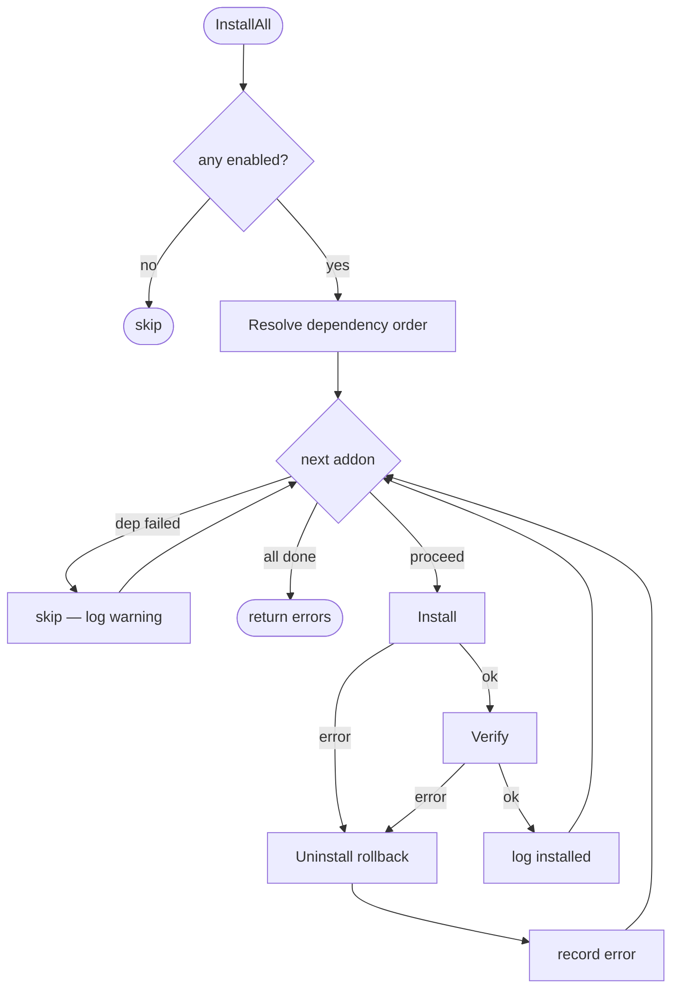

# The addon system

Addons are optional components the user can opt into per-cluster — things
like Flux for GitOps, cert-manager for TLS, an external secret store, or
a storage class. They're decoupled from the core phase model: the phases
deploy OKD itself and stop; addons install on top of a live cluster.

## Goals

1. **Zero-cost for users who don't want them.** If you don't enable any
   addons, you pay no install time and no cluster resources.
2. **Discoverable in the wizard.** The wizard lists all registered addons
   and lets the user pick which to install during the post-install phase.
3. **Pluggable without modifying core code.** Adding a new addon means
   dropping a file in the catalog — no edits to the wizard, phase, or
   manager.
4. **Dependency-aware.** An addon can declare it depends on another addon
   (e.g., cert-manager depends on trust-manager). The manager resolves
   the order.

## The Addon interface

```go
type Addon interface {
    Info() AddonInfo
    Install(ctx context.Context, env *Environment) error
    Verify(ctx context.Context, env *Environment) error
    Uninstall(ctx context.Context, env *Environment) error
}
```

Addons that take user-tunable settings opt into the `ConfigurableAddon`
sub-interface:

```go
type ConfigurableAddon interface {
    Addon
    DefaultSettings() map[string]string
    ValidateSettings(settings map[string]string) []string
}
```

`Info` is static metadata (name, display name, dependencies, priority);
`DefaultSettings` / `ValidateSettings` run at wizard time and again before
install; `Install`, `Verify`, and `Uninstall` do the actual work against a
live cluster via the `Environment` (which carries an executor, logger,
kubeconfig, and per-addon settings).

## Registration via init()

Every addon package has an `init()` function that calls `addon.Register`:

```go
func init() {
    if err := addon.Register(&fluxAddon{}); err != nil {
        panic(err)  // init() cannot propagate
    }
}
```

The binary imports the catalog root for side effects:

```go
import _ "github.com/qxtaiba/okdctl/internal/addon/catalog"
```

which in turn imports each addon package for its side effects. This is
why every addon automatically becomes visible to the wizard without any
explicit wiring — the import graph is the registration.

**Caveat:** because registration happens via `init()`, the order is
non-deterministic. Addons must not depend on other addons being
*registered* (they can depend on other addons being *installed*, via
`Info().Dependencies`).

## The catalog

`internal/addon/catalog/` is the top-level package that blank-imports
every supported addon. Adding a new addon means:

1. Create a package under `internal/addon/catalog/<name>/`
2. Implement the `Addon` interface
3. Add an `init()` that calls `addon.Register`
4. Blank-import your package in `internal/addon/catalog/catalog.go`

Nothing else. The wizard, the manager, and the phase all discover your
addon automatically via the registry.

## Lifecycle

The post-install phase iterates enabled addons and calls their `Install`
in dependency order, then `Verify`. On failure, `InstallAll` has
per-addon rollback: if addon C fails, the manager attempts to uninstall
any addons in C's dependency closure that were installed in this
invocation, then returns the aggregated error.

Addon lifecycle (per addon, in dependency order):



## WizardProvider: addons that contribute config fields

Addons that need user input (e.g., Flux wants a Git repository URL) can
implement `WizardProvider`:

```go
type WizardProvider interface {
    WizardFields() []WizardField
}
```

The wizard renders these fields in a dedicated "Addon settings" step
after the user selects which addons to enable. Field values are persisted
into the addon's settings map (`config.Addons["flux"].Settings`) and
surfaced via `AddonConfig` to `ValidateSettings` and `Install`.

## EnsureNamespace and other shared helpers

Most addons install into their own namespace (`flux-system`,
`cert-manager`, etc.). The `addon.EnsureNamespace(ctx, env, name)` helper
creates the namespace idempotently. Similar helpers live in
`internal/addon/helpers.go`:

- `addon.BuildOpaqueSecret(name, namespace, data)` — canonical k8s
  Opaque Secret manifest builder for addons
- `addon.EnsureNamespace(ctx, env, name)` — idempotent namespace
  creation with retries

New cross-addon helpers belong in `helpers.go`. Do **not** write per-addon
copies of namespace creation or secret construction logic.

## Why not Helm?

A reasonable question. Helm would let users install any chart. But:

- Most homelab users don't want to think about Helm values files
- Helm state lives in the cluster (as secrets), which makes "what's
  installed?" a k8s query rather than a config inspection
- Some addons need host-side work (e.g., adding a DNS record for cert
  challenges) that Helm can't do
- The addon pattern here gives us a typed, validated interface for
  addons that can reach both host *and* cluster

Individual addons may internally use `helm install` (via the executor)
to deploy their workloads — that's fine. What we're avoiding is making
*Helm itself* the addon mechanism.
