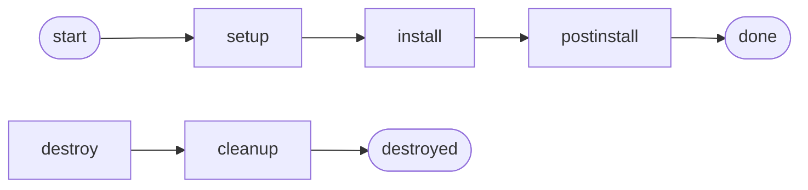

# The phase model

`okdctl` organizes all its work into **phases** and **steps**. A phase
is a cohesive unit of work (setup, install, post-install, destroy, cleanup);
a step is one operation inside a phase (install a package, render a
template, provision VMs). Phases are orchestrated by shared infrastructure
so each phase implementation only has to declare *what* happens, not *how*
it's sequenced, logged, skipped, or rolled back.

Phase flow:



## The contract

Every phase follows the same contract:

1. A phase declares an ordered list of `StepDef` values via a private
   method (`setupSteps`, `installSteps`, `postinstallSteps`, etc.)
2. The phase's `Execute` method builds a `distribution.Orchestrator` from
   those steps and calls `Run(ctx)`
3. The orchestrator runs steps in order, handling: progress output, per-step
   logging, conditional skipping, error propagation, and graceful cancellation

The ordering is authoritative: step N+1 may assume step N completed
successfully. If a step fails and it is not marked `NonFatal`, the
orchestrator stops and returns the error — later steps do not run.

## StepDef: the step descriptor

```go
type StepDef struct {
    ID          StepID
    Name        string
    Desc        string
    NonFatal    bool
    ReRunSafe   ReRunSafety                              // required — BuildSteps panics on zero value
    AlreadyDone func(ctx context.Context) (bool, error)  // required for ReRunSafeNo steps — BuildSteps panics without it; optional for ReRunSafeYes
    SkipWhen    func() bool
    SkipReason  string
    OnStart     func()                                   // optional hook fired before Exec
    Exec        func(ctx context.Context) error
    OnError     func(error)
}
```

`ReRunSafe` is mandatory. `BuildSteps` panics with
`"must declare ReRunSafe"` when the field is left at its zero value
(`ReRunSafeUnset`). Every `StepDef` literal must commit to either
`ReRunSafeYes` or `ReRunSafeNo`.

Each phase has a method that returns `[]StepDef`. See `internal/distribution/
okd/setup/steps.go` for a representative example — the setup phase declares
~20 steps split into sub-methods (`setupBaseSteps`, `setupManifestSteps`,
`setupWebSteps`, `setupInfraSteps`) for readability, concatenated by the
top-level `setupSteps` function.

## Orchestration

`distribution.BuildSteps` converts `[]StepDef` into the orchestrator's
internal representation — it panics if any `StepDef` omits `ReRunSafe`.
`distribution.NewOrchestrator(...)` creates the runner. `orchestrator.Run(ctx)`
iterates, emitting progress events and invoking each step's `Exec`. If `ctx`
is cancelled mid-run (SIGINT / SIGTERM), the current step finishes but later
steps are skipped — no forced kills.

The orchestrator is intentionally simple. It does **not** do parallelism,
DAG scheduling, or resumable checkpoints. Each phase's step list is
designed to be short enough (tens of steps, not hundreds) that linear
execution is fast enough, and idempotent enough that re-running from
scratch after a failure is the recovery strategy.

## BasePhase: the shared substrate

All phases embed `phase.BasePhase`, a struct with the shared dependencies
every phase needs:

```go
type BasePhase struct {
    Exec     *executor.Executor           // subprocess runner (oc, terraform, etc.)
    Log      *slog.Logger                 // structured logger
    Version  string                       // OKD version string, for display
    Recorder distribution.MetricsRecorder // per-step + overall observation sink (nil → nopMetricsRecorder via WithRecorder)
    Reporter logutil.ProgressReporter     // progress sink for long-running operations (nil → NopProgressReporter via NewBasePhase)
}
```

Phases that need OS-family awareness (setup, cleanup) embed `BasePhase` and
add their own `platform.OS` / `platform.PackageManager` fields — `BasePhase`
itself stays distribution-agnostic.

Phases get shared helper methods on `BasePhase` for common operations:

- `p.OcResourceExists(ctx, errPrefix, args...)` — "does this k8s resource
  exist?" via `oc get`, wrapping errors with a consistent prefix
- `p.OcPollOutput(ctx, prefix, desc, timeout, predicate, args...)` — poll
  `oc` output until a predicate matches, with bounded retry

New cross-phase helpers belong on `BasePhase`. Phase-local helpers belong
as private methods on the phase's own type. Do not introduce a new
"utility" package for what is really phase logic.

## Adding a new step

The ordinary case: you want to add a step to an existing phase.

1. Add a new `StepID` constant in the phase's `steps.go`
2. Append a new `StepDef` literal to the appropriate sub-method (e.g.,
   `setupBaseSteps` for host-level operations, `setupInfraSteps` for
   network configuration)
3. Set `ReRunSafe` — this field is **required**; `BuildSteps` panics with
   `"must declare ReRunSafe (ReRunSafeYes or ReRunSafeNo)"` when it is left
   at its zero value:
   - `ReRunSafeYes` — the step is idempotent; re-running it after a partial
     failure is safe. Prefer this default wherever possible.
   - `ReRunSafeNo` — the step has side-effects that must not repeat (e.g.,
     generating ignition files, deploying terraform infra). `AlreadyDone`
     is **required** for every `ReRunSafeNo` step — `BuildSteps` panics with
     `"is ReRunSafeNo but has no AlreadyDone guard"` when it is absent. Wire
     a func that detects whether the work product already exists; the
     orchestrator skips `Exec` when it returns true.
4. If the step body is longer than ~15 lines, extract it to a named
   method on the phase (e.g., `generateKubeVIPManifests`)
5. Set `NonFatal: true` only if the step is genuinely optional (a warning
   is acceptable when it fails)
6. Set `SkipWhen` for steps gated on config flags

Do **not** introduce new per-step builder functions or new orchestrators.
The `StepDef` literal form is the one and only way to declare steps.

## Adding a new phase

This is rare. If you think you need a new phase:

1. Check whether your work fits into an existing phase as a step
2. Check whether it's really an addon (see `addons.md`)
3. If it is a new phase: create a package under
   `internal/distribution/okd/<phase>`, define a `Phase` struct that
   embeds `phase.BasePhase`, declare an `Execute` method, and wire it
   into the top-level `okd.Provisioner` in `internal/distribution/okd/`

New phases must have a corresponding destroy/cleanup path. Do not ship
a phase that creates state without a documented way to remove it.

## Why this design

**Why data-driven steps instead of chained function calls?** Steps are
data, which means they're inspectable and tooled. The wizard and CLI can
list the steps that *would* run without executing them, skip modes are
trivial, and a phase's structure is visible at a glance.

**Why a shared orchestrator instead of per-phase logic?** Every phase
needs progress output, error handling, skip logic, and logging. Writing
that once in the orchestrator means phase authors focus on the domain
logic, and the UX is consistent across phases.

**Why no DAG or parallelism?** On a single Proxmox host, most work is
either CPU-bound on one tool (terraform, openshift-install) or waiting
on external state (cluster operators becoming ready). Parallelism adds
complexity without meaningful speedup, and makes rollback-on-failure
genuinely hard. Linear execution is the correct choice for this domain.
