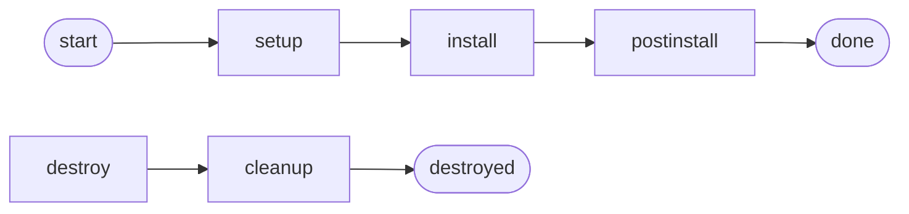

# The phase model

`okdctl` organizes all its work into **phases** and **steps**. A phase
is a cohesive unit of work (setup, install, post-install, destroy, cleanup);
a step is one operation inside a phase (install a package, render a
template, provision VMs). The phases are orchestrated by shared
infrastructure, so each phase implementation only has to declare *what*
happens, not *how* it's sequenced, logged, skipped, or resumed.

Phase flow:


```mermaid
flowchart LR
    S([start]) --> setup
    setup --> install
    install --> postinstall
    postinstall --> E([done])

    destroy --> cleanup
    cleanup --> F([destroyed])
```

## The contract

Every phase follows the same contract:

1. A phase declares an ordered list of `StepDef` values via a private
   method (`setupSteps`, `installSteps`, `postinstallSteps`, etc.)
2. The phase's `Execute` method builds a `distribution.Orchestrator` from
   those steps and calls `Run(ctx)`
3. The orchestrator runs steps in order, handling: progress output, per-step
   logging, conditional skipping, error propagation, and graceful cancellation

The ordering is authoritative: step N+1 may assume step N completed
successfully. If a step fails and it is not marked `NonFatal`, the
orchestrator stops and returns the error — later steps do not run.

## StepDef: the step descriptor

```go
type StepDef struct {
    ID          StepID
    Name        string
    NonFatal    bool
    AlreadyDone func(ctx context.Context) (bool, error)  // optional guard; the step is skipped when it reports true
    SkipWhen    func() bool
    SkipReason  string
    SkipReasonFunc func() string
    OnStart     func()                                   // optional hook fired before Exec
    Exec        func(ctx context.Context) error
    OnError     func(error)
}
```

`AlreadyDone` is the one step-level resume mechanism. The orchestrator
calls it before `Exec`: when it reports true the step is recorded as
skipped ("already done"), and when it returns an error the orchestrator
logs a warning and runs the step anyway. A step without a guard runs every
time its phase runs, so its body has to be safe to repeat.

Each phase has a method that returns `[]StepDef`. See `internal/distribution/
okd/setup/steps.go` for a representative example — the setup phase declares
~20 steps split into sub-methods (`setupBaseSteps`, `setupManifestSteps`,
`setupWebSteps`, `setupInfraSteps`) for readability, concatenated by the
top-level `setupSteps` function.

## Orchestration

`distribution.BuildSteps` validates the `[]StepDef` (it panics on an empty
`ID` or `Name`) and `distribution.NewOrchestrator(...)` runs that list
directly; there is no separate runtime step type. `orchestrator.Run(ctx)`
iterates, emitting progress events and invoking each step's `Exec`. If `ctx`
is cancelled mid-run (SIGINT / SIGTERM), cancellation reaches the active
step and its subprocesses, and later steps are skipped. Subprocess shutdown
is bounded and may terminate the active child; completion is not guaranteed.

The orchestrator is intentionally simple. It does not do parallelism,
DAG scheduling, or rollback — a failed step stops the run and leaves
completed work in place. Recovery is re-running `okdctl deploy`: the
deploy engine (`internal/deploy`) writes an on-disk deploy-state marker
at each phase boundary, and the next run resumes from the phase it
names. An install or postinstall marker routes past setup entirely, so
cluster identity material (ignition, CA, auth bundle) is never wiped or
regenerated under live VMs; only `--fresh` restarts from setup, at the
cost of those credentials. The resumed phase runs its step list from the
top: a step with an `AlreadyDone` guard is skipped when its work product
already exists, and every other step runs again.

The setup phase is the exception, because it is restarted rather than
resumed. `Provisioner.Setup` removes the work directory before the first
step, which discards the generated install-config, manifests, ignition
and ISOs together with the setup marker written just before it. A deploy
re-run after a setup failure therefore starts at setup and regenerates all
of them, and the guards that look for those files (`generate-config`,
`generate-manifests`, `generate-ignition`) never fire on that path. The
setup guards that can still skip a step are the ones that compare against
state outside the work directory: `download-tools` checks a version
sentinel next to the binaries in the bin dir, and `upload-isos` compares
each rebuilt ISO's sha256 with the copy already on Proxmox storage.

When teardown is the right move instead, `okdctl cleanup` removes local
files after a setup-phase failure (terraform state is still empty) and
`okdctl destroy` removes provisioned resources once install has begun.
The failure summary names the applicable command.

## BasePhase: the shared substrate

All phases embed `phase.BasePhase`, a struct with the shared dependencies
every phase needs:

```go
type BasePhase struct {
    Exec       *executor.Executor            // subprocess runner (oc, terraform, etc.)
    Log        *slog.Logger                  // structured logger
    Recorder   distribution.MetricsRecorder  // per-step + overall observation sink (nil → nopMetricsRecorder via WithRecorder)
    Reporter   logutil.ProgressReporter      // progress sink for long-running operations (nil → NopProgressReporter via NewBasePhase)
    StatusLine logutil.StatusLineReporter    // updatable status line for the install monitor (nil → NopStatusLineReporter)
}
```

The setup phase embeds `BasePhase` and adds the host package manager
(`platform.Manager`, dnf on the RHEL-family bastion); `BasePhase` itself
stays distribution-agnostic.

The phases get shared helper methods on `BasePhase` for common operations:

- `p.OcResourceExists(ctx, errPrefix, args...)` — "does this k8s resource
  exist?" via `oc get`, wrapping errors with a consistent prefix
- `p.OcPollOutput(ctx, prefix, desc, timeout, predicate, args...)` — poll
  `oc` output until a predicate matches, with bounded retry

New cross-phase helpers belong on `BasePhase`. Phase-local helpers belong
as private methods on the phase's own type. Do not introduce a new
"utility" package for what is really phase logic.

## Adding a new step

The ordinary case: you want to add a step to an existing phase.

1. Add a new `StepID` constant in the phase's `steps.go`
2. Append a new `StepDef` literal to the appropriate sub-method (e.g.,
   `setupBaseSteps` for host-level operations, `setupInfraSteps` for
   network configuration)
3. Decide whether the step needs an `AlreadyDone` guard:
   - A step whose body is safe to repeat (an idempotent apply, a render
     that overwrites its own output) needs none. It runs again whenever its
     phase runs. Prefer this shape wherever possible.
   - A step with side effects that must not repeat needs a guard that
     detects its work product; the orchestrator skips `Exec` when the guard
     returns true. Point the guard at evidence that survives to the next
     run: a setup guard that looks inside the work directory never fires on
     a deploy re-run, because setup wipes that directory first.
4. If the step body is longer than ~15 lines, extract it to a named
   method on the phase (e.g., `generateKubeVIPManifests`)
5. Set `NonFatal: true` only if the step is genuinely optional (a warning
   is acceptable when it fails)
6. Set `SkipWhen` for steps gated on config flags

Do **not** introduce new per-step builder functions or new orchestrators.
The `StepDef` literal form is the one and only way to declare steps.

## Adding a new phase

This is rare. If you think you need a new phase:

1. Check whether your work fits into an existing phase as a step
2. Check whether it's really an addon (see `addons.md`)
3. If it is a new phase: create a package under
   `internal/distribution/okd/<phase>`, define a `Phase` struct that
   embeds `phase.BasePhase`, declare an `Execute` method, and wire it
   into the top-level `okd.Provisioner` in `internal/distribution/okd/`

New phases must have a corresponding destroy/cleanup path. Do not ship
a phase that creates state without a documented way to remove it.

## Design notes

The steps are data instead of chained function calls so they can be
inspected and tooled. In particular, the wizard and CLI can list the
steps that would run without executing them, the skip modes are
trivial, and a phase's structure is visible at a glance.

The orchestrator is shared instead of per-phase because every phase
needs the same progress output, error handling, skip logic, and logging.
That machinery is written once, so the phase authors focus on the domain
logic and the UX stays consistent across phases.

There is no DAG scheduling or parallelism on purpose. On a single
Proxmox host, most of the work is either CPU-bound on one tool
(terraform, openshift-install) or waiting on external state such as
cluster operators becoming ready. In that setting, parallelism adds
complexity without meaningful speedup and makes the linear
resume-on-re-run model much harder to reason about.
