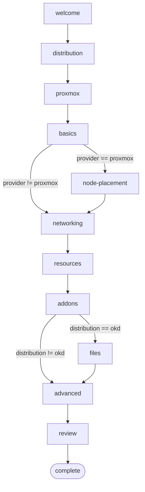

# The wizard

The wizard is the interactive TUI that walks the user through configuring
a cluster. It runs the first time `okdctl deploy` is invoked without
an existing `okdctl.yaml`, and can be re-run on demand to edit an
existing config.

## Data-driven, not code-driven

The wizard is built on a **data-driven** model: each step is declared as
a `StepDefinition` value with sections, fields, and validators. The
wizard runtime (`internal/tui/wizard/datadriven.go`) renders any
`StepDefinition` without needing custom code per step.

```go
type StepDefinition struct {
    ID           StepID
    Title        string
    DisplayTitle string
    Description  string
    Sections     []SectionDefinition

    Validate     func(values map[string]string) error
    Apply        func(step *DataDrivenStep, cfg *config.Config) error
    ShouldShow   func(*config.Config) bool
    ExtraContent func(values map[string]string, width int) string
}
```

The wizard package lives under `internal/tui/wizard/`:

- `datadriven.go` — the runtime that renders any `StepDefinition`
- `steps/` — the step definitions themselves, one file per step (welcome,
  distribution, proxmox, basics, node_placement, networking, resources,
  addons, files, advanced, review)

Each step's file declares a single `StepDefinition` literal plus its
helper validators. Adding a new step takes three additive edits: create
the file under `steps/`, add a `StepType` constant and a `DefaultConfig()`
entry in `internal/tui/wizard/config.go`, and register a factory in
`defaultStepRegistrations` in `internal/cli/wizard_setup.go`.

## FieldDefinition: the smallest unit

```go
type FieldDefinition struct {
    Key      string
    Label    string
    Default  string
    Help     string
    Type     FieldType   // see FieldType constants in datadriven.go
    Options  []string    // used by FieldTypeSelect and FieldTypeMultiSelect
    Required bool
    Validate func(string) error

    ConfigSet ConfigSetter  // how to push this field into *config.Config
    ConfigGet ConfigGetter  // how to read this field from *config.Config
}
```

`ConfigSet` / `ConfigGet` are the two-way bridge between the wizard's
in-memory map of `map[string]string` values and the typed `*config.Config`
struct. The `SetString`, `SetInt`, `SetBool`, `GetString`, `GetInt`
helpers in `datadriven.go` wrap common type conversions so field
definitions stay terse:

```go
{
    Key:      "cluster.name",
    Label:    "Cluster name",
    Required: true,
    Validate: ValidateClusterName,
    ConfigSet: wizard.SetString(func(c *config.Config, v string) {
        c.Cluster.Name = v
    }),
    ConfigGet: wizard.GetString(func(c *config.Config) string {
        return c.Cluster.Name
    }),
},
```

## Why data-driven

The payoff is consistency and testability. Every step gets the same
header, navigation, validation behavior, help text placement, and
keyboard shortcuts, because one runtime renders them all; hand-written
bubbletea models would drift apart step by step. The step definitions
are also pure data with pure validator functions, so you can unit-test
a validator or snapshot-test a step's rendered output without spinning
up a TUI.

## The escape hatch: ExtraContent and WithExtraContentFunc

Some steps need to render content that isn't a form field: a preview of
what will be created, a live Proxmox discovery result, a warning banner.
These steps use `ExtraContent` in the step definition or
`WithExtraContentFunc` on the step instance to render arbitrary
lipgloss output below the form.

This is the only point where a step can have custom rendering. If you
find yourself wanting more than `ExtraContent` allows, the right
answer is usually "your step is too complex — split it" rather than
"the wizard needs a new escape hatch."

## Validation lifecycle

The wizard runs validation in layers, so a mistake surfaces only once the
user has actually had a chance to see it:

- The first layer is per-field: typing clears that field's error
  immediately, and leaving a field (tab/shift-tab) runs `FormField.Check`
  and records the result — but only for a field the user has actually
  focused. That keeps navigation honest, since tabbing past a field the
  user never visited can't manufacture an error for it.
- The second layer fires when the user presses enter: `touchAll` marks
  every field in the step touched, `Validate` records every field's
  current error across the whole form, and `FocusFirstInvalid` moves
  focus and the viewport to the first invalid one. The status row shows a
  generic "fix the highlighted fields to continue" message, while each
  field's own error row carries the specifics.
- The third layer is `StepDefinition.Validate`, which runs only once
  every field passes, enforcing cross-field invariants a single field's
  `Check` can't see on its own.

This is followed by two steps that run regardless of which layer above
caught something: `Apply` writes the step's values into `*config.Config`
once validation passes, and `config.Config.Validate` runs once more at
the end of the wizard, before `deploy` actually starts — the same
validator `loadConfig` runs in `internal/cli/helpers.go`.

That layering is also why a `Default` on a `FieldDefinition` counts as a
real starting value rather than a placeholder: it satisfies a `Required`
field immediately, so the wizard never manufactures an error for a field
the user hasn't touched. The `Placeholder` field, by contrast, is only a
dim hint shown while the field is empty, and never becomes part of the
field's actual value.

If the user hits escape, the state is not discarded. It stays in the
step's field values so they can come back and tweak.

The step flow is shown below. The steps with `ShouldShow` predicates
appear twice, once as the active step and once as a `(skipped)` bypass,
to make the condition explicit:



## HA anti-affinity requirements

The advanced step's "enable ha anti-affinity" field spreads control-plane
VMs across Proxmox nodes via ha-manager anti-affinity. That feature
requires Proxmox VE 9 or later plus a multi-node cluster, since a single
host cannot satisfy the anti-affinity rule. In particular, once enabled,
ha-manager supersedes the per-VM `startup{}` ordering on any HA-triggered
relocation.

## Why not huh, survey, or promptui

We looked at the Charmbracelet `huh` library and decided to skip it.
`huh` is great for one-shot forms but fights the multi-section, back-
and-forth, live-preview wizard structure we needed. The data-driven
model gives us what `huh` would have given us (consistent rendering,
reusable validators) plus per-step custom extra content, which `huh`
doesn't support.

The wizard is built directly on `bubbletea`, `bubbles`, and `lipgloss`.
