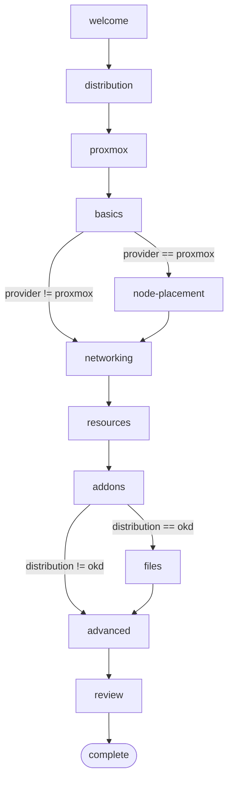

# The wizard

The wizard is the interactive TUI behind every hands-on okdctl operation:
a hero hub screen offering five verbs, the data-driven configure flow
underneath its `deploy`/`edit config` verbs, and the day-two flow its
`manage nodes` verb swaps into in the same program. In particular, this
is not a deploy-only walkthrough — the hub is a first-class entry point
in its own right, and `okdctl node manage` deep-links straight into that
flow.

## The hub: one program, five verbs

The wizard's entry point is `steps.WelcomeStep`, the hero-hub: a centered
wordmark screen `okdctl deploy` opens on every time, offering five verbs
over an existing `okdctl.yaml` (`deploy`, `edit config`, `manage nodes`,
`cluster status`, `destroy`) or two on a blank slate (`get started`,
`quit`). The hub is a hand-written `WizardStep`, not a `StepDefinition`,
since a launcher has no fields to declare; it also implements
`heroRenderer` and `splitSuppressor`, so the frame drops its own header
chrome and never puts a context pane beside it — the block-letter
wordmark is the whole screen's identity.

That five-verb menu resolves one of three ways. The `deploy` and `edit
config` verbs, plus `get started` on the blank slate, continue forward
into the data-driven configure flow described below, in the same
program, on the step-list diagram further down this page. The `manage
nodes` verb instead swaps the wizard onto a different flow in-process,
through `Model.SwapFlow`: the live step set and chrome are replaced, the
hub's own steps and position are held in a single `suspendedFlow`, and
escaping the swapped-in flow's first screen restores the hub exactly
where the operator left it. That single-suspension rule is deliberate:
`SwapFlow` accepts only one suspended flow at a time, since the hub is
the only screen that swaps, and a sub-flow it swaps into never swaps
again. The `cluster status` and `destroy` verbs resolve to neither: the
hub reports them back to the CLI, which prints a handoff line once the
TUI has released the terminal — `run: okdctl status` or `run: okdctl
destroy`. That leaves `okdctl status` as the one place cluster health is
probed and rendered, and `okdctl destroy`'s own confirmation ladder as
the guard, rather than reimplementing either behind a menu entry.

That said, `okdctl node manage` is a direct deep-link into the
manage-nodes flow, not a hub verb: it builds the same Cluster Lifecycle
session the hub's `manage nodes` verb would (`newLifecycleSession`, the
same `lifecycle.Chrome()`) and runs it as its own top-level
`wizard.RunFlow` program, skipping the hub screen entirely. This suits a
scripted or automation-adjacent entry: `okdctl node manage` refuses
outright without a terminal, naming `okdctl node resize/add/remove` as
the alternative, while `okdctl deploy` always opens on the hub first.

## Unsaved edits: nothing persists until review

The configure flow keeps its progress in memory only. That progress is
the `*config.Config` the steps write into: every keystroke in a form
field applies the active step to it (`ConfigSyncMsg`), so a step left
with escape — back to the review step after a digit jump, say — has
already written what was typed. The config file itself is written
exactly once, by `persistWizardConfig`, after the review step's action
is confirmed; a session closed or quit before then leaves `okdctl.yaml`
as it was.

That is why quitting asks first. The first ctrl+c on a configure step —
distribution through review — whose live config no longer matches the
one the session opened with raises a one-line question in the status
row; a second ctrl+c or `y` discards the edits and quits, and any other
key returns to the form without reaching it. That comparison is a digest
of the config as `config.Effective` resolves it, plus the credential
fields that never serialize (`configDigest`), so an edit typed and then
typed back is no edit at all, and ctrl+c with nothing changed quits
immediately. This applies to the configure flow only: the hub and the
day-two flows quit as before, and the screens that run an operation keep
their own `QuitGuard`.

## Data-driven, not code-driven

The wizard is built on a **data-driven** model: each step is declared as
a `StepDefinition` value with sections, fields, and validators. The
wizard runtime (`internal/tui/wizard/datadriven.go`) renders any
`StepDefinition` without needing custom code per step.

```go
type StepDefinition struct {
    ID           StepID
    Title        string
    DisplayTitle string
    Description  string
    Sections     []SectionDefinition

    Validate     func(values map[string]string) error
    Apply        func(step *DataDrivenStep, cfg *config.Config) error
    ShouldShow   func(*config.Config) bool
    ExtraContent func(values map[string]string, width int) string
}
```

The wizard package lives under `internal/tui/wizard/`:

- `datadriven.go` — the runtime that renders any `StepDefinition`
- `steps/` — the step definitions themselves, one file per step (welcome,
  distribution, proxmox, basics, node_placement, networking, resources,
  addons, files, advanced, review)

Each step's file declares a single `StepDefinition` literal plus its
helper validators. Adding a new step takes three additive edits: create
the file under `steps/`, and add a `StepType` constant and a
`DefaultConfig()` entry in `internal/tui/wizard/config.go`. The third
edit registers a factory in the `RegisterAll` list in
`internal/tui/wizard/steps/register.go`, which `internal/cli/wizard_setup.go`
calls.

## FieldDefinition: the smallest unit

```go
type FieldDefinition struct {
    Key      string
    Label    string
    Default  string
    Help     string
    Type     FieldType   // see FieldType constants in datadriven.go
    Options  []string    // used by FieldTypeSelect and FieldTypeMultiSelect
    Required bool
    Validate func(string) error

    ConfigSet ConfigSetter  // how to push this field into *config.Config
    ConfigGet ConfigGetter  // how to read this field from *config.Config
}
```

`ConfigSet` / `ConfigGet` are the two-way bridge between the wizard's
in-memory map of `map[string]string` values and the typed `*config.Config`
struct. The `SetString`, `SetInt`, `SetBool`, `GetString`, `GetInt`
helpers in `datadriven.go` wrap common type conversions so field
definitions stay terse:

```go
{
    Key:      "cluster.name",
    Label:    "Cluster name",
    Required: true,
    Validate: ValidateClusterName,
    ConfigSet: wizard.SetString(func(c *config.Config, v string) {
        c.Cluster.Name = v
    }),
    ConfigGet: wizard.GetString(func(c *config.Config) string {
        return c.Cluster.Name
    }),
},
```

The `Width` field on a `FieldDefinition` picks one of four `FieldWidth`
classes, sizing that field's input box in columns independent of the
section's available width: `FieldWidthAuto` (the zero value, 64 columns),
`FieldWidthNumber` (16 columns, sized for counts and byte sizes),
`FieldWidthPath` (80 columns, sized for filesystem paths), and
`FieldWidthFull` (the whole inner width, used for a key-value table or a
long free-text field). This keeps a short numeric field from stretching
edge-to-edge just because the terminal is wide, and keeps a long path
field from being clipped just because a neighboring field is narrow.

## Why data-driven

The payoff is consistency and testability. Every step gets the same
header, navigation, validation behavior, help text placement, and
keyboard shortcuts, because one runtime renders them all; hand-written
bubbletea models would drift apart step by step. The step definitions
are also pure data with pure validator functions, so you can unit-test
a validator or snapshot-test a step's rendered output without spinning
up a TUI.

## The escape hatch: ExtraContent and WithExtraContentFunc

Some steps need to render content that isn't a form field: a preview of
what will be created, a live Proxmox discovery result, a warning banner.
These steps use `ExtraContent` in the step definition or
`WithExtraContentFunc` on the step instance to render arbitrary
lipgloss output below the form.

This is the only point where a step can have custom rendering. If you
find yourself wanting more than `ExtraContent` allows, the right
answer is usually "your step is too complex — split it" rather than
"the wizard needs a new escape hatch."

## Layout: the frame budget

The wizard renders inside a fixed frame budget, so every resize keeps the
header, viewport, status row, and footer stacked in exactly the same
shape, with no leftover row that could push the border past the last
terminal line.

That budget is `fixedLayoutOverhead`: three rows for the header (the
brand row, the title/trail row, and the bottom rule), one row for the
status row, two rows for the footer (the scroll-indicator rule and the
help bar), and four rows of vertical padding (the wizard border's top and
bottom plus the outer container's top and bottom). The total is 10, so
the viewport height is `V = H − 10` at every terminal height `H`, floored
to 1 rather than going negative.

This same accounting applies horizontally: the content column is `W − 6`
(four columns of outer padding plus the wizard border's two side
columns), and the bordered box lipgloss draws around that content is
`W − 4` (the content width plus the border's two side columns added back
in). The wizard's own floor is 60×20; below it neither the wizard nor a
screenshot renders reliably, so `contentWidth` clamps to 54 rather than
shrinking further.

That `W − 4` frame also has a ceiling: below 150 columns it's capped at
112, so a wide-but-not-split terminal doesn't stretch the form edge to
edge just because there's room. `OuterContainerStyle` still renders at
the full terminal width — the cap's leftover columns become blank
right-hand margin, never a partial row for AltScreen to leave dirty.

| Terminal      | Outer width (frame) | Content width | Viewport height (H−10) |
| ------------- | -------------------- | -------------- | ----------------------- |
| 60×20 (floor) | 56                    | 54              | 10                       |
| 80×24         | 76                    | 74              | 14                       |
| 100×30        | 96                    | 94              | 20                       |
| 120×40        | 112                   | 110             | 30                       |
| 149×40        | 112                   | 110             | 30                       |

In particular, the same 10-row overhead applies whether the terminal
sits at the floor or at 149×40, since every row in the budget is a fixed
chrome row rather than one that scales with terminal size — only the
viewport's own height absorbs the difference.

## Layout: the wide-terminal split

At and above 150 columns the frame stops growing the form and splits
instead: a form column capped at 104, a 1-column rule, and a dim context
pane that takes whatever's left after the rule, clamped to 28–44 columns.
The form (and every `ResizableStep`) is sized to just the form column,
not the full frame — `bodyWidth`, not `contentWidth` — while the header,
status row, and footer still span the whole frame, form and pane both.

| Terminal | Form | Rule | Pane | Content width |
| -------- | ---- | ---- | ---- | -------------- |
| 150×48   | 104  | 1    | 39   | 144             |
| 151×48   | 104  | 1    | 40   | 145             |
| 180×48   | 104  | 1    | 44   | 149             |

180 is wide enough that the pane hits its 44-column ceiling; the
remaining width past 104+1+44 becomes idle margin rather than stretching
the pane further, the same way the sub-150 cap keeps the form itself from
stretching. See `internal/tui/wizard/contextpane.go` for what the pane
renders — a dim, unfocusable summary of the step list, the current step's
answered facts, and the focused field's help text.

The split is also gated on height, not width alone: `splitLayout`
compares the terminal against `splitMinHeight(stepCount)`, defined as
`fixedLayoutOverhead + paneStepsHeaderRows + stepCount` — the pane's
STEPS section needs one row per step plus its own header row, on top of
the same fixed chrome the single-column layout already pays for. That
floor scales with the flow's own step count, so a longer flow needs a
taller terminal before it splits at all; below it, even a terminal at or
past `wideSplitWidth` takes the capped single-column tier instead of
splitting into a pane too short to hold the step list.

This is what fills the pane once that height floor is cleared:
`renderContextPane` renders up to three sections in a strict priority
order — STEPS, then SO FAR, then FOCUSED FIELD — and a height squeeze
sacrifices them from the bottom of that order upward. The first section
to go is FOCUSED FIELD: it renders only once SO FAR's own attempt has
succeeded or had nothing to show, and even then only if its own lines
still fit whatever rows remain. The next to go is SO FAR, once the pane
is squeezed tighter still: when its lines do not fit the rows STEPS left
behind, `renderContextPane` drops it, and that drop alone vetoes FOCUSED
FIELD too, regardless of whether FOCUSED FIELD's own content would have
fit on its own. That leaves STEPS itself, which turns to its
`…`-truncation fallback — keeping rows around the current step and
marking the rest with a trailing ellipsis — only as a defensive floor
below the guarantee `splitMinHeight` already gives it; `splitLayout`'s own
gate keeps that floor unreached in practice. That veto is a real
distinction: a section absent because its step does not implement the
relevant interface — no `answeredStep`, no `focusedFieldStep`, or a
`focusedFieldStep` with nothing currently focused — never counts as a
drop and never vetoes what comes after it. In particular, only a section
that had content and did not fit silences the rest of the cascade.

## The status row

The status row is always exactly one row, whether or not it has anything
to show, so a step reporting an error never grows or shrinks the frame
around it. That row renders blank when `m.err` is nil, and renders a
two-space inset plus an error icon and message once `m.err` is set,
matching the two-space inset the viewport's own content column uses.
This is also why the row's style calls `Inline(true)` rather than relying
on `Padding`: lipgloss v2 skips `Padding` under `Inline`, so the inset is
prepended to the string literally instead.

## Validation lifecycle

The wizard runs validation in layers, so a mistake surfaces only once the
user has actually had a chance to see it:

- The first layer is per-field: typing clears that field's error
  immediately, and leaving a field (tab/shift-tab) runs `FormField.Check`
  and records the result — but only for a field the user has actually
  focused. That keeps navigation honest, since tabbing past a field the
  user never visited can't manufacture an error for it.
- The second layer fires when the user presses enter: `touchAll` marks
  every field in the step touched, `Validate` records every field's
  current error across the whole form, and `FocusFirstInvalid` moves
  focus and the viewport to the first invalid one. The status row shows a
  generic "fix the highlighted fields to continue" message, while each
  field's own error row carries the specifics.
- The third layer is `StepDefinition.Validate`, which runs only once
  every field passes, enforcing cross-field invariants a single field's
  `Check` can't see on its own.

This is followed by two steps that run regardless of which layer above
caught something: `Apply` writes the step's values into `*config.Config`
once validation passes, and `config.Config.Validate` runs once more at
the end of the wizard, before `deploy` actually starts — the same
validator `loadConfig` runs in `internal/cli/helpers.go`.

That layering is also why a `Default` on a `FieldDefinition` counts as a
real starting value rather than a placeholder: it satisfies a `Required`
field immediately, so the wizard never manufactures an error for a field
the user hasn't touched. The `Placeholder` field, by contrast, is only a
dim hint shown while the field is empty, and never becomes part of the
field's actual value.

If the user hits escape, the state is not discarded. It stays in the
step's field values so they can come back and tweak.

The step flow is shown below. The steps with `ShouldShow` predicates
appear twice, once as the active step and once as a `(skipped)` bypass,
to make the condition explicit:


```mermaid
flowchart TD
    welcome --> distribution
    distribution --> proxmox
    proxmox --> basics
    basics -->|"provider == proxmox"| nodePlacement[node-placement]
    basics -->|"provider != proxmox"| networking
    nodePlacement --> networking
    networking --> resources
    resources --> addons
    addons -->|"distribution == okd"| filesStep[files]
    addons -->|"distribution != okd"| advanced
    filesStep --> advanced
    advanced --> review
    review --> E([complete])
```

## Scrolling to the focused field: LineSpan and SpanProvider

The wizard keeps the focused field on screen by asking the active step
where that field lives in its own `View()` output, rather than tracking
scroll position itself. That contract is `SpanProvider`: a step
implementing `FocusedSpan() (LineSpan, bool)` reports the inclusive
0-based line range — a `LineSpan{Start, End}` — the focused field
occupied the last time the step rendered, or `false` when nothing is
focused yet or the step has not rendered at all.

This works because `MultiSectionForm` records a span per field during
`View`, indexed by section and field position, so `FocusedSpan` only has
to look up the currently focused group's index into that slice. That
same span cannot be looked up directly against the viewport, though,
since `padContent` may have wrapped an over-wide step line into several
viewport rows; `viewportSpan` translates a step-line span into viewport
rows using the `contentRows` index `padContent` recorded, before
`scrollToFocusedField` decides whether to move the viewport's offset at
all. That offset step is also why a centered step never implements
`SpanProvider`: its content is re-rendered with a `PaddingTop` shift
before it is measured, which would desynchronize any span recorded
before that shift.

In particular, a span taller than the viewport, or a span whose start
already sits above the visible window, snaps the viewport to the span's
start; a span whose end has scrolled past the bottom snaps to put that
end on the last visible row; and a span already fully visible leaves the
viewport untouched. This is the mechanism `FocusChangedMsg` triggers on
every focus move, and the same mechanism `FocusFirstInvalid` rides after
an enter-key validation failure to bring the first invalid field into
view.

## HA anti-affinity requirements

The advanced step's "enable ha anti-affinity" field spreads control-plane
VMs across Proxmox nodes via ha-manager anti-affinity. That feature
requires Proxmox VE 9 or later plus a multi-node cluster, since a single
host cannot satisfy the anti-affinity rule. In particular, once enabled,
ha-manager supersedes the per-VM `startup{}` ordering on any HA-triggered
relocation.

## The deploy stream: a second program

The screen that actually runs a deploy is never the same program as the
screen that led to it. The path to it varies: confirming `deploy`
straight from the hub over an existing configuration skips the configure
flow entirely and starts the stream screen against the configuration
already on disk, while confirming it from the review step — at the end
of a configure flow reached via `get started` or `edit config` — starts
that same stream screen only after the whole configure flow has run to
completion and exited. In particular, `--yes` reaches the stream screen
(or, under `--no-tui`, the plain stderr checklist described in [the
README](../../README.md#without-the-tui)) without any wizard screen
running first at all. That stream screen, whenever it does run, is a
fresh `wizard.RunFlow` over `deployexec.NewSteps`, started only once any
earlier wizard program has already returned — a genuine two-program
boundary, unlike the hub's own in-process `SwapFlow` into a day-two
flow.

The stream groups the install engine's own setup/install/postinstall
phases into five coarser, human-facing ones — `prep`, `ignition`,
`infra`, `install`, `verify`, the order `deployexec.PhaseOrder` runs and
collapses them in — each a checklist section of the steps it owns. That
checklist shares its screen with a live log pane, in one of three tiers
depending on how much room the terminal gives it: the wide-split tier
renders the log as the frame's own right-hand pane (`StreamStep`
implements `paneRenderer`, filling the same slot the context pane
otherwise occupies, live rather than static), a narrower terminal instead
gets a fixed six-line tail riding under the checklist, and either tier
can be swapped to a third, full-screen view with the `f` key. The `l` key
locks the visible window in place rather than following the newest line,
useful for reading a burst of output before it scrolls away. This is the
same `SplitsFrame` gate the configure flow's context pane uses, evaluated
against the stream's own two-screen step count rather than the configure
flow's.

## Why not huh, survey, or promptui

We looked at the Charmbracelet `huh` library and decided to skip it.
`huh` is great for one-shot forms but fights the multi-section, back-
and-forth, live-preview wizard structure we needed. The data-driven
model gives us what `huh` would have given us (consistent rendering,
reusable validators) plus per-step custom extra content, which `huh`
doesn't support.

The wizard is built directly on `bubbletea`, `bubbles`, and `lipgloss`.
